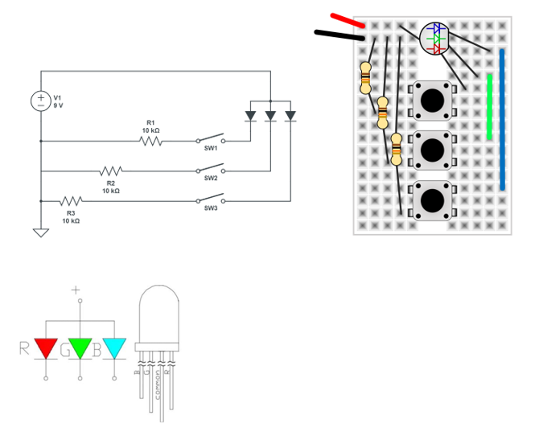

# The Color Orange

Build the new circuit below using the 9-Volt battery, a 10 kΩ resistor, an RGB LED, and a blue potentiometer. Turn the knob of the potentiometer until you create the color orange.

```{r echo=FALSE}

```
