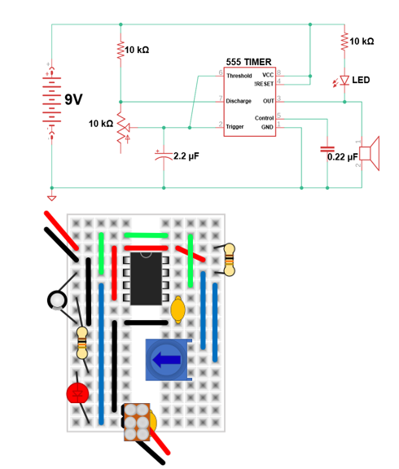

# Cricket

Modify the previous circuit by replacing the large black capacitor with a small black capacitor, moving the LED and the 10 kΩ resistor connected to it, and adding the speaker connector as shown.
As an instructor to check your circuit before you flip the power switch to ON.


```{r echo=FALSE}

```
