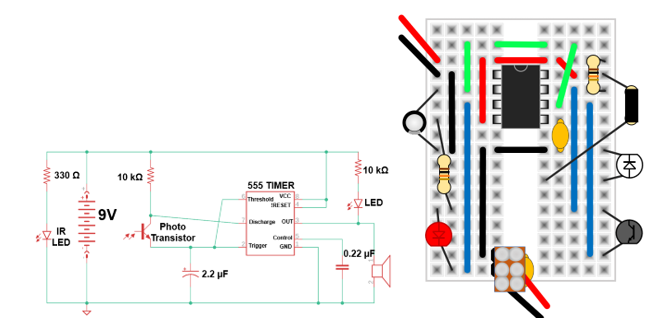

# Lonely Cricket

Remove the blue potentiometer, and add the black 330Ω resistor, the clear infrared-LED, and black phototransistor. Bend the infrared-LED and black phototransistor so that they both point to the right.

Find another team that has finished building this circuit or wait for them to finish. When they do, point their infrared-LED at your phototransistor and vice-versa to make the crickets begin chirping.

```{r echo=FALSE}

```
